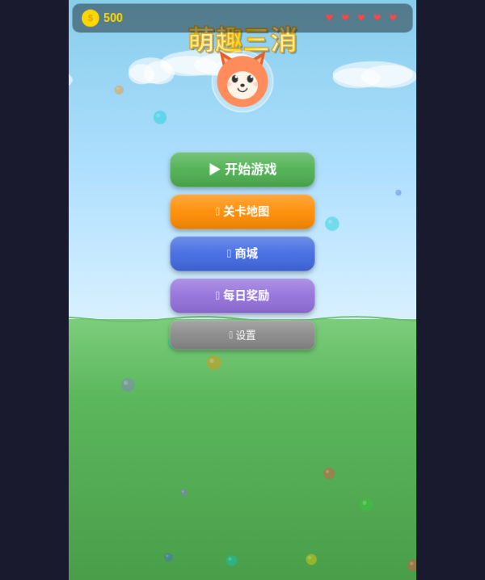
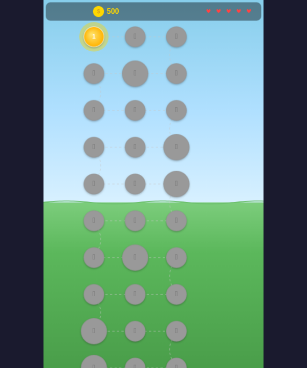
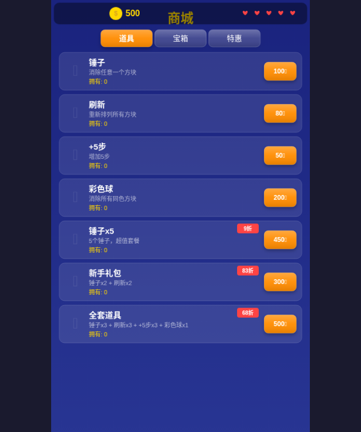
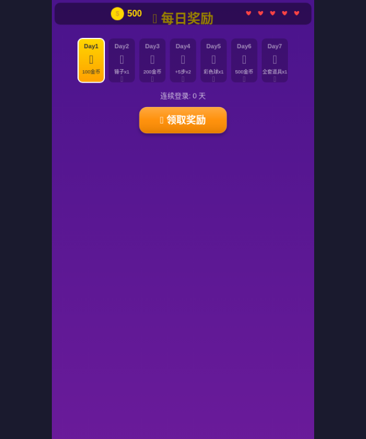
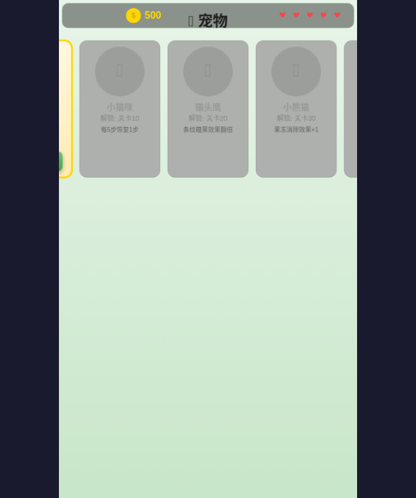

# 萌趣三消 - Cute Match

一款纯Canvas渲染的三消类微信小游戏，复刻经典三消玩法，包含特殊方块合成、多种游戏模式、障碍物系统、宠物养成、商城等完整功能。

## 🎮 游戏界面

### 主菜单



游戏启动界面，包含小狐狸吉祥物、金币/体力显示和五大功能入口。

### 关卡地图



50关蜿蜒路径地图，已通关关卡显示星级评价，当前关卡脉冲发光。

### 商城系统



道具/宝箱/特惠三大分类，金币购买锤子、刷新、+5步、彩色球等道具。

### 每日奖励



7天连续登录奖励日历，每天可领取不同道具和金币。

### 宠物系统



5种可爱宠物，各有独特技能，消除充能释放。

## ✨ 功能特性

### 核心玩法
- **9×9棋盘**，7种颜色方块
- **拖拽/点击**两种交换方式
- **连锁反应**：消除→下落→再消除，自动连锁
- **星级评价**：1-3星，根据得分评定

### 特殊方块
| 方块 | 生成方式 | 效果 |
|------|----------|------|
| 条纹糖果（横） | 4个横向匹配 | 消除整行 |
| 条纹糖果（竖） | 4个纵向匹配 | 消除整列 |
| 包装糖果 | L型/T型匹配 | 3×3范围爆炸 |
| 彩色球 | 5个匹配 | 消除所有同色 |
| 彩虹球 | 彩色球+彩色球 | 全屏消除 |

### 特殊合成
| 组合 | 效果 |
|------|------|
| 条纹 + 条纹 | 十字消除（1行+1列） |
| 条纹 + 包装 | 3行+3列消除 |
| 包装 + 包装 | 5×5范围爆炸 |
| 彩色球 + 条纹 | 所有同色变条纹 |
| 彩色球 + 包装 | 所有同色变包装 |

### 5种游戏模式
| 模式 | 说明 |
|------|------|
| 目标分数 | 在限定步数内达到目标分数 |
| 消除果冻 | 消除所有果冻覆盖层 |
| 运送果子 | 将樱桃/榛子运送到底部 |
| 收集方块 | 收集指定数量的特殊方块 |
| 订单模式 | 按要求收集指定组合 |

### 障碍物系统
| 障碍物 | 说明 |
|--------|------|
| 冰块（1-3层） | 相邻消除时减少层数 |
| 锁链 | 方块被锁定不能移动 |
| 石头 | 不可移动、不可消除 |
| 巧克力 | 每步随机蔓延 |
| 糖霜 | 需要相邻消除才能清除 |
| 传送门 | 方块从一端传入另一端 |

### 道具系统
- 🔨 **锤子**：消除任意一个方块
- 🔄 **刷新**：重新排列所有方块
- ➕ **+5步**：增加5步操作
- 🌈 **彩色球**：放置一个彩色球

### 宠物系统
| 宠物 | 技能 | 解锁 |
|------|------|------|
| 🦊 小狐狸 | 每消除10个随机消除1个 | 第1关 |
| 🐱 小猫咪 | 每5步恢复1步 | 第10关 |
| 🦉 猫头鹰 | 条纹糖果效果翻倍 | 第20关 |
| 🐼 小熊猫 | 果冻消除效果+1 | 第30关 |
| 🦄 独角兽 | 每局开始随机生成彩色球 | 第40关 |

## 🛠 技术栈

- **纯Canvas渲染**，无DOM依赖，适配微信小游戏
- **Web Audio API** 生成音效，无需音频文件
- **粒子系统** 特效
- **localStorage** 本地存档
- **13个模块**，代码结构清晰

## 📁 项目结构

```
happy_match/
├── index.html              # Web预览入口
├── game_bundle.js          # 合并后的完整包
├── game.js                 # 微信小游戏入口
├── game.json               # 微信小游戏配置
├── project.config.json     # 开发者工具配置
├── screenshots/            # 游戏截图
│   ├── 01_main_menu.png
│   ├── 02_level_map.png
│   ├── 03_shop.png
│   ├── 04_daily_reward.png
│   └── 05_pets.png
└── js/
    ├── config.js           # 全局配置
    ├── candy.js            # 方块精灵绘制
    ├── board.js            # 棋盘核心逻辑
    ├── animation.js        # 动画系统
    ├── particles.js        # 粒子特效
    ├── sound.js            # 音效系统
    ├── game.js             # 游戏控制器
    ├── ui.js               # UI界面管理
    ├── map.js              # 50关配置
    ├── shop.js             # 商城数据
    ├── storage.js          # 本地存储
    ├── pets.js             # 宠物系统
    └── main.js             # 主入口
```

## 🚀 运行方式

### Web预览
```bash
cd happy_match
python -m http.server 8080
# 访问 http://localhost:8080
```

### 微信小游戏
1. 下载[微信开发者工具](https://developers.weixin.qq.com/miniprogram/dev/devtools/download.html)
2. 导入 `happy_match` 目录
3. 在 `project.config.json` 中填入你的 AppID
4. 点击编译运行

## 📋 50关难度递进

| 关卡 | 模式 | 新增元素 |
|------|------|----------|
| 1-5 | 目标分数 | 基础玩法 |
| 6-10 | 目标分数 | 6种糖果 |
| 11-15 | 消除果冻 | 果冻系统 |
| 16-20 | 消除果冻 | 冰块障碍 |
| 21-25 | 目标分数 | 锁链障碍 |
| 26-30 | 消除果冻 | 多层冰块 |
| 31-35 | 运送果子 | 果子系统 |
| 36-40 | 运送果子 | 石头障碍 |
| 41-45 | 混合模式 | 巧克力 |
| 46-50 | 高难度混合 | 全部元素 |

## 📄 开源协议

MIT License

## 🤝 贡献

欢迎提交 Issue 和 Pull Request！
